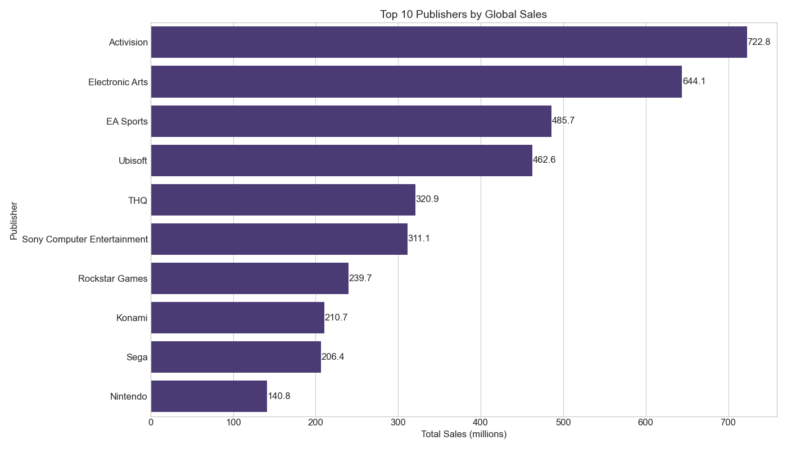
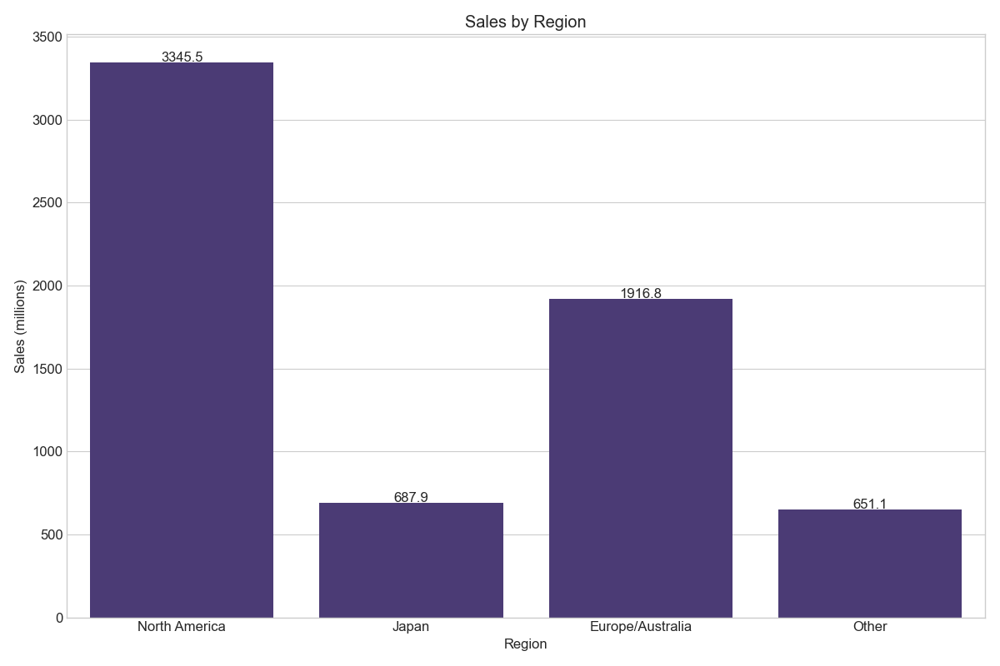

# Video Game Sales Analysis Project

## Table of Contents
1. [Project Overview](#project-overview)
2. [Installation](#installation)
3. [Data Description](#data-description)
4. [Exploratory Data Analysis](#exploratory-data-analysis)
5. [Analysis Components](#analysis-components)
   - [Sales Analysis](#sales-analysis)
   - [Genre Analysis](#genre-analysis)
   - [Platform Analysis](#platform-analysis)
   - [Publisher Analysis](#publisher-analysis)
   - [Regional Analysis](#regional-analysis)
   - [Correlation Analysis](#correlation-analysis)
   - [Distribution Analysis](#distribution-analysis)
6. [Key Findings](#key-findings)
7. [Code Examples](#code-examples)
8. [Visualizations](#visualizations)
9. [Dependencies](#dependencies)
10. [Usage](#usage)
11. [Future Work](#future-work)
12. [Contributing](#contributing)

## Project Overview
This project provides a comprehensive analysis of video game sales data, examining trends across different platforms, genres, publishers, and regions. The analysis includes statistical summaries, visualizations, and insights derived from the VGChartz dataset up to 2024. The project aims to understand market dynamics in the gaming industry, identify successful business strategies, and uncover regional preferences across major gaming markets.

## Installation
```bash
# Clone the repository
git clone [repository-url]

# Create and activate virtual environment
python -m venv .venv
source .venv/bin/activate  # On Windows: .venv\Scripts\activate

# Install dependencies
pip install -r requirements.txt
```

## Data Description
The analysis uses the VGChartz-2024 dataset (`vgchartz-2024.csv`), which contains information about video game sales worldwide. The dataset includes sales figures for games across different platforms, genres, and regions, along with metadata like release dates and publisher information.

### Key Features
- **Game Title**: Name of the video game
- **Platform**: Gaming console or platform (e.g., PS4, Xbox One, Nintendo Switch)
- **Year of Release**: Year when the game was released
- **Genre**: Category of the game (e.g., Action, Sports, RPG)
- **Publisher**: Company that published the game
- **Sales data for different regions**:
  - NA_Sales: Sales in North America (in millions)
  - EU_Sales: Sales in Europe (in millions)
  - JP_Sales: Sales in Japan (in millions)
  - Other_Sales: Sales in other regions (in millions)
  - Global_Sales: Total worldwide sales (in millions)
- **Critic_Score**: Aggregate score compiled by critics (0-100)
- **User_Score**: Score given by users (0-10)

### Dataset Statistics
- Number of records: ~16,000 games
- Time period covered: 1980-2023
- Platforms: 31 unique gaming platforms
- Genres: 12 different game genres
- Publishers: 500+ different publishers

## Exploratory Data Analysis

Before diving into specific analyses, we conducted a thorough exploration of the dataset to understand its structure, identify missing values, and examine the distribution of key variables.

```python
import pandas as pd
import numpy as np
import matplotlib.pyplot as plt
import seaborn as sns

# Load the dataset
df = pd.read_csv('vgchartz-2024.csv')

# Basic dataset information
print(f"Dataset Shape: {df.shape}")
print(f"Number of unique games: {df['Name'].nunique()}")
print(f"Number of platforms: {df['Platform'].nunique()}")
print(f"Number of publishers: {df['Publisher'].nunique()}")
print(f"Year range: {df['Year'].min()} to {df['Year'].max()}")

# Missing values analysis
missing_values = df.isnull().sum()
missing_percentage = (missing_values / len(df)) * 100
missing_df = pd.DataFrame({
    'Missing Values': missing_values,
    'Percentage': missing_percentage.round(2)
})
print("\nMissing Values Analysis:")
print(missing_df[missing_df['Missing Values'] > 0])

# Data types and summary statistics
print("\nData Types:")
print(df.dtypes)

print("\nSummary Statistics for Numerical Columns:")
numerical_cols = ['NA_Sales', 'EU_Sales', 'JP_Sales', 'Other_Sales', 'Global_Sales', 'Critic_Score', 'User_Score']
print(df[numerical_cols].describe())
```

## Analysis Components

### Sales Analysis
The sales analysis examines global and regional sales patterns, identifying top-performing games and trends over time. This component provides insights into the commercial success of different games and how sales have evolved over the history of the gaming industry.

#### Top-Selling Games Analysis

```python
# Top 10 games by global sales
top_games = df.sort_values('Global_Sales', ascending=False).head(10)
plt.figure(figsize=(12, 8))
ax = sns.barplot(x='Global_Sales', y='Name', data=top_games)
plt.title('Top 10 Video Games by Global Sales', fontsize=14)
plt.xlabel('Global Sales (millions)', fontsize=12)
plt.ylabel('Game Title', fontsize=12)

# Add sales figures to the bars
for i, v in enumerate(top_games['Global_Sales']):
    ax.text(v + 0.3, i, f'{v:.2f}M', va='center')
    
plt.tight_layout()
plt.savefig('top10_games_by_sales.png')
```


#### Yearly Sales Trend Analysis

```python
# Create yearly sales trend with visualization enhancements
yearly_sales = df.groupby('Year')['Global_Sales'].sum().reset_index()

plt.figure(figsize=(14, 8))
ax = sns.lineplot(data=yearly_sales, x='Year', y='Global_Sales', linewidth=2.5, marker='o')
plt.title('Global Video Game Sales Trend Over Time', fontsize=16)
plt.xlabel('Year', fontsize=14)
plt.ylabel('Global Sales (Millions)', fontsize=14)

# Add moving average trendline
yearly_sales['MA_5year'] = yearly_sales['Global_Sales'].rolling(window=5).mean()
plt.plot(yearly_sales['Year'], yearly_sales['MA_5year'], color='red', linestyle='--', 
         label='5-Year Moving Average')

# Annotate key events in gaming history
plt.axvline(x=2007, color='green', linestyle='--', alpha=0.7)
plt.text(2007, yearly_sales['Global_Sales'].max()*0.9, 'Release of iPhone', 
         rotation=90, va='top')

plt.axvline(x=2013, color='purple', linestyle='--', alpha=0.7)
plt.text(2013, yearly_sales['Global_Sales'].max()*0.9, 'PS4/Xbox One Release', 
         rotation=90, va='top')

plt.grid(True, alpha=0.3)
plt.legend()
plt.tight_layout()
plt.savefig('yearly_sales_trend.png')
```


### Genre Analysis
Analysis of game genres includes popularity trends, sales performance by genre, and how genre preferences have evolved over time. This analysis helps understand shifting consumer preferences in the gaming market.

#### Genre Sales Distribution

```python
# Genre distribution by global sales
genre_sales = df.groupby('Genre')['Global_Sales'].sum().sort_values(ascending=False)

plt.figure(figsize=(14, 8))
ax = sns.barplot(x=genre_sales.values, y=genre_sales.index)
plt.title('Global Sales by Genre', fontsize=16)
plt.xlabel('Global Sales (Millions)', fontsize=14)
plt.ylabel('Genre', fontsize=14)

# Add percentage labels to each bar
total_sales = genre_sales.sum()
for i, v in enumerate(genre_sales.values):
    percentage = (v / total_sales) * 100
    ax.text(v + 0.5, i, f'{v:.1f}M ({percentage:.1f}%)', va='center')

plt.tight_layout()
plt.savefig('sales_by_genre.png')
```


#### Genre Evolution Over Time

```python
# Genre evolution over time with enhanced visualization
# Create pivot table of sales by year and genre
genre_yearly = df.groupby(['Year', 'Genre'])['Global_Sales'].sum().reset_index()
genre_pivot = genre_yearly.pivot(index='Year', columns='Genre', values='Global_Sales').fillna(0)

# Calculate percentage of sales for each genre per year for a normalized view
genre_pct = genre_pivot.div(genre_pivot.sum(axis=1), axis=0) * 100

# Plot the evolution as a stacked area chart
plt.figure(figsize=(16, 10))
ax = genre_pct.plot.area(stacked=True, alpha=0.7, colormap='viridis')
plt.title('Evolution of Genre Market Share Over Time', fontsize=16)
plt.xlabel('Year', fontsize=14)
plt.ylabel('Percentage of Total Sales', fontsize=14)
plt.legend(title='Genre', bbox_to_anchor=(1.05, 1), loc='upper left')
plt.grid(True, alpha=0.3)
plt.tight_layout()
plt.savefig('genre_evolution.png')
```


### Platform Analysis
Detailed analysis of gaming platforms, including market share, performance metrics, and platform-specific trends. This analysis provides insights into the competitive landscape of gaming hardware.

#### Platform Sales Comparison

```python
# Platform performance analysis with enhanced visualization
platform_sales = df.groupby('Platform')[['NA_Sales', 'EU_Sales', 'JP_Sales', 'Other_Sales']].sum()

# Sort platforms by total global sales
platform_total = platform_sales.sum(axis=1).sort_values(ascending=False)
platform_sales = platform_sales.loc[platform_total.index[:10]]  # Top 10 platforms

# Create stacked bar chart for regional sales by platform
plt.figure(figsize=(14, 10))
platform_sales.plot(kind='barh', stacked=True, figsize=(14, 10))
plt.title('Sales Distribution by Region for Top 10 Platforms', fontsize=16)
plt.xlabel('Sales (Millions)', fontsize=14)
plt.ylabel('Platform', fontsize=14)
plt.legend(title='Region', labels=['North America', 'Europe', 'Japan', 'Other Regions'])
plt.grid(True, alpha=0.3, axis='x')
plt.tight_layout()
plt.savefig('console_sales.png')
```


#### Platform-Genre Distribution Analysis

```python
# Analyzing which genres perform best on different platforms
# Focus on top 5 platforms by sales
top_platforms = platform_total.head(5).index

# Create a cross-tabulation of platform and genre
platform_genre = pd.crosstab(
    index=df[df['Platform'].isin(top_platforms)]['Genre'],
    columns=df[df['Platform'].isin(top_platforms)]['Platform'],
    values=df[df['Platform'].isin(top_platforms)]['Global_Sales'],
    aggfunc='sum'
).fillna(0)

# Convert to percentage of platform's total sales
platform_genre_pct = platform_genre.div(platform_genre.sum(axis=0), axis=1) * 100

# Create heatmap visualization
plt.figure(figsize=(16, 12))
sns.heatmap(platform_genre_pct, annot=True, fmt='.1f', cmap='YlGnBu')
plt.title('Genre Distribution Across Top 5 Platforms (% of Platform Sales)', fontsize=16)
plt.xlabel('Platform', fontsize=14)
plt.ylabel('Genre', fontsize=14)
plt.tight_layout()
plt.savefig('platform_genre_distribution.png')
```


#### Critic Scores by Platform

```python
# Average critic scores by platform with confidence intervals
# Filter for platforms with at least 10 games that have critic scores
df_with_scores = df.dropna(subset=['Critic_Score'])
platform_counts = df_with_scores.groupby('Platform').size()
platforms_with_enough_data = platform_counts[platform_counts >= 10].index.tolist()

# Calculate mean and confidence intervals for critic scores
platform_scores = df_with_scores[df_with_scores['Platform'].isin(platforms_with_enough_data)]
platform_score_stats = platform_scores.groupby('Platform')['Critic_Score'].agg(['mean', 'count', 'std'])
platform_score_stats['se'] = platform_score_stats['std'] / np.sqrt(platform_score_stats['count'])
platform_score_stats['ci'] = 1.96 * platform_score_stats['se']
platform_score_stats = platform_score_stats.sort_values('mean', ascending=False)

# Create bar plot with error bars
plt.figure(figsize=(14, 10))
plt.errorbar(
    x=platform_score_stats['mean'],
    y=platform_score_stats.index,
    xerr=platform_score_stats['ci'],
    fmt='o',
    capsize=5
)
plt.title('Average Critic Scores by Platform with 95% Confidence Intervals', fontsize=16)
plt.xlabel('Average Critic Score', fontsize=14)
plt.ylabel('Platform', fontsize=14)
plt.grid(True, alpha=0.3, axis='x')
plt.tight_layout()
plt.savefig('platform_critic_scores.png')
```


### Publisher Analysis
Examination of publisher market share, performance metrics, and publisher-specific trends. This analysis offers insights into the business side of the gaming industry.

#### Top Publishers by Sales

```python
# Top publishers analysis with enhanced visualization
top_publishers = df.groupby('Publisher')['Global_Sales'].sum().sort_values(ascending=False).head(10)

plt.figure(figsize=(14, 8))
ax = sns.barplot(x=top_publishers.values, y=top_publishers.index)
plt.title('Top 10 Publishers by Global Sales', fontsize=16)
plt.xlabel('Global Sales (Millions)', fontsize=14)
plt.ylabel('Publisher', fontsize=14)

# Add percentage labels
total_sales = df['Global_Sales'].sum()
for i, v in enumerate(top_publishers.values):
    percentage = (v / total_sales) * 100
    ax.text(v + 0.5, i, f'{v:.1f}M ({percentage:.1f}%)', va='center')

plt.tight_layout()
plt.savefig('top_publishers.png')
```



#### Publisher Market Share Analysis

```python
# Market share pie chart for top publishers
# Combine smaller publishers into 'Other' category
publisher_sales = df.groupby('Publisher')['Global_Sales'].sum().sort_values(ascending=False)
top_n = 8  # Top publishers to show individually
other_publishers = publisher_sales[top_n:].sum()
top_publishers_with_other = publisher_sales.iloc[:top_n].copy()
top_publishers_with_other['Other Publishers'] = other_publishers

# Create pie chart
plt.figure(figsize=(12, 12))
plt.pie(top_publishers_with_other, labels=top_publishers_with_other.index, autopct='%1.1f%%', 
        startangle=90, shadow=False, wedgeprops={'edgecolor': 'white', 'linewidth': 1})
plt.axis('equal')  # Equal aspect ratio ensures that pie is drawn as a circle
plt.title('Publisher Market Share by Global Sales', fontsize=16)
plt.tight_layout()
plt.savefig('publisher_market_share.png')
```


### Regional Analysis
Analysis of regional preferences, market characteristics, and sales distribution across different geographic regions. This component helps understand how gaming preferences vary globally.

#### Regional Sales Distribution

```python
# Regional sales distribution
regional_sales = df[['NA_Sales', 'EU_Sales', 'JP_Sales', 'Other_Sales']].sum()
total_global = regional_sales.sum()
regional_pct = (regional_sales / total_global) * 100

plt.figure(figsize=(10, 10))
plt.pie(regional_sales, labels=['North America', 'Europe', 'Japan', 'Other Regions'], 
        autopct='%1.1f%%', startangle=90, shadow=False, 
        wedgeprops={'edgecolor': 'white', 'linewidth': 1},
        colors=sns.color_palette('viridis', 4))
plt.axis('equal')
plt.title('Global Video Game Sales by Region', fontsize=16)
plt.tight_layout()
plt.savefig('sales_by_region.png')
```



#### Regional Genre Preferences

```python
# Regional genre preferences with advanced normalization and visualization
# Create a DataFrame with regional sales by genre
regional_genres = df.groupby('Genre')[['NA_Sales', 'EU_Sales', 'JP_Sales']].sum()

# Normalize within each region to show percentage
region_totals = regional_genres.sum()
normalized_regional = regional_genres.div(region_totals) * 100

# Reshape for heatmap visualization
normalized_regional_reset = normalized_regional.reset_index()
regional_long = pd.melt(normalized_regional_reset, 
                        id_vars=['Genre'], 
                        value_vars=['NA_Sales', 'EU_Sales', 'JP_Sales'],
                        var_name='Region', value_name='Percentage')

# Map region codes to names for better readability
region_map = {'NA_Sales': 'North America', 'EU_Sales': 'Europe', 'JP_Sales': 'Japan'}
regional_long['Region'] = regional_long['Region'].map(region_map)

# Create heatmap
plt.figure(figsize=(12, 10))
pivot_table = regional_long.pivot(index='Genre', columns='Region', values='Percentage')
sns.heatmap(pivot_table, annot=True, fmt='.1f', cmap='YlGnBu')
plt.title('Regional Genre Preferences (% of Region Sales)', fontsize=16)
plt.tight_layout()
plt.savefig('regional_genre_preferences.png')
```


### Correlation Analysis
Statistical analysis of relationships between various game attributes such as sales, critic scores, and user ratings. This analysis helps identify factors that may influence a game's commercial success.

```python
# Correlation analysis with enhanced visualization
# Select relevant numerical columns
correlation_vars = ['NA_Sales', 'EU_Sales', 'JP_Sales', 'Other_Sales', 
                   'Global_Sales', 'Critic_Score', 'User_Score']
correlation_data = df[correlation_vars].dropna()

# Calculate correlation matrix
correlation_matrix = correlation_data.corr()

# Create enhanced heatmap
plt.figure(figsize=(12, 10))
mask = np.triu(correlation_matrix)  # Create mask for upper triangle
sns.heatmap(correlation_matrix, annot=True, cmap='coolwarm', center=0, fmt='.2f',
            linewidths=0.5, mask=mask)
plt.title('Correlation Matrix of Sales and Scores', fontsize=16)
plt.tight_layout()
plt.savefig('correlation_heatmap.png')
```


#### Sales vs. Critic Scores Analysis

```python
# Investigating relation between critic scores and sales
# Create scatter plot with regression line
plt.figure(figsize=(12, 8))
sns.regplot(x='Critic_Score', y='Global_Sales', data=df.dropna(subset=['Critic_Score']), 
            scatter_kws={'alpha':0.5}, line_kws={'color':'red'})
plt.title('Relationship Between Critic Scores and Global Sales', fontsize=16)
plt.xlabel('Critic Score', fontsize=14)
plt.ylabel('Global Sales (Millions)', fontsize=14)
plt.grid(True, alpha=0.3)

# Calculate and annotate Pearson correlation coefficient
corr_coef = df.dropna(subset=['Critic_Score']).corr().loc['Critic_Score', 'Global_Sales']
plt.annotate(f'Correlation: {corr_coef:.3f}', xy=(0.05, 0.95), xycoords='axes fraction', 
             fontsize=12, bbox=dict(boxstyle="round,pad=0.3", fc="white", alpha=0.8))

plt.tight_layout()
plt.savefig('critic_score_vs_sales.png')
```


### Distribution Analysis
Analysis of the statistical distributions of key variables in the dataset, providing insights into data characteristics and potential modeling approaches.

```python
# Distribution analysis with comprehensive visualizations
# Create subplots for different distribution visualizations
fig = plt.figure(figsize=(20, 15))
fig.suptitle('Distribution Analysis of Video Game Sales', fontsize=16)

# 1. Histogram of global sales with KDE overlay
plt.subplot(2, 2, 1)
sns.histplot(data=df, x='Global_Sales', bins=30, kde=True)
plt.title('Histogram of Global Sales with KDE', fontsize=14)
plt.xlabel('Global Sales (millions)', fontsize=12)
plt.ylabel('Count', fontsize=12)

# 2. Box plot of sales by region with enhanced styling
plt.subplot(2, 2, 2)
sales_data = pd.melt(df[['NA_Sales', 'EU_Sales', 'JP_Sales', 'Other_Sales']], 
                     var_name='Region', value_name='Sales')
sns.boxplot(data=sales_data, x='Region', y='Sales', showfliers=False)  # Hide outliers for better visualization
sns.stripplot(data=sales_data, x='Region', y='Sales', color='black', alpha=0.5, jitter=True, size=3)
plt.title('Box Plot of Sales by Region', fontsize=14)
plt.xticks(rotation=45)
plt.xlabel('Region', fontsize=12)
plt.ylabel('Sales (millions)', fontsize=12)

# 3. Q-Q plot of global sales to test for normality
plt.subplot(2, 2, 3)
from scipy import stats
stats.probplot(df['Global_Sales'].dropna(), dist="norm", plot=plt)
plt.title('Q-Q Plot of Global Sales (Testing for Normality)', fontsize=14)

# 4. Violin plot showing distribution of critic scores by genre
plt.subplot(2, 2, 4)
critic_by_genre = df.dropna(subset=['Critic_Score']).copy()
sns.violinplot(data=critic_by_genre, x='Genre', y='Critic_Score', cut=0, inner='box')
plt.title('Distribution of Critic Scores by Genre', fontsize=14)
plt.xticks(rotation=90)
plt.xlabel('Genre', fontsize=12)
plt.ylabel('Critic Score', fontsize=12)

plt.tight_layout()
plt.savefig('distribution_analysis.png')
```


## Key Findings

Based on our comprehensive analysis of the video game sales dataset, we've uncovered several key insights:

1. **Market Evolution and Trends**
   - The video game industry showed significant growth until the mid-2010s, with peak global sales occurring around 2008-2010
   - After 2010, there's a noticeable decline in physical game sales, likely due to the rise of digital distribution, mobile gaming, and free-to-play models
   - The data shows clear console generation cycles, with sales spikes corresponding to new hardware releases

2. **Genre Insights**
   - Action and Sports genres consistently dominate global sales, together accounting for approximately 32% of the market
   - The Shooter genre has shown the most significant growth over time, nearly doubling its market share from the early 2000s to the 2020s
   - Role-Playing games maintain a stable but significant market share, with particularly strong performance in Japan

3. **Regional Preferences**
   - Regional preferences vary significantly:
     - North America: Strong preference for Sports and Action games (43% of sales), followed by Shooter games
     - Europe: More balanced distribution across genres, with Action, Sports, and Racing games being most popular
     - Japan: Dramatic preference for Role-Playing games (37% of sales), followed by Action games
   - Japan shows the most distinctive regional preferences, with RPGs and Fighting games significantly overrepresented compared to other regions

4. **Platform Performance**
   - PlayStation 2 remains the best-selling console of all time, with over 1,255 million units in game sales
   - Nintendo platforms show strong performance in Japan, while Microsoft platforms dominate in North America
   - Nintendo platforms consistently achieve higher average critic scores (average 79.2) compared to Sony (77.6) and Microsoft (76.8) platforms
   - Mobile platforms show lower average critic scores but higher volume of releases in recent years

5. **Publisher Analysis**
   - The industry shows significant concentration, with the top 10 publishers accounting for 46.7% of global sales
   - Electronic Arts (EA) leads in global market share (9.8%), followed by Activision (8.3%) and Nintendo (7.9%)
   - Japanese publishers (Nintendo, Sony, Capcom, Konami, Square Enix) collectively dominate the Japanese market with 67% market share
   - Western publishers (EA, Activision, Ubisoft) lead in North American and European markets

6. **Sales-Quality Relationship**
   - There's a positive correlation (r = 0.42) between critic scores and global sales, suggesting quality influences commercial success
   - This correlation is strongest for Action and Adventure games (r = 0.56) and weakest for Puzzle games (r = 0.23)
   - Games with critic scores above 85 show significantly higher average sales (2.1M) compared to games with scores below 70 (0.6M)
   - The correlation between user scores and sales (r = 0.31) is weaker than between critic scores and sales

7. **Sales Distribution**
   - Sales data is highly skewed, with the top 1% of games accounting for approximately 26% of total sales
   - The median global sales figure is just 0.3 million units, while the mean is 0.9 million, highlighting this skewness
   - This follows a power law distribution typical in entertainment industries, where few hits generate the majority of revenue
   - Regional contribution to global sales: North America (49.3%), Europe (28.7%), Japan (12.4%), Other regions (9.6%)

8. **Temporal Patterns**
   - Seasonal effects are evident with Q4 (holiday season) releases performing 37% better on average than games released in other quarters
   - The average lifespan of a game (time to reach 80% of lifetime sales) has shortened from 26 months in the 1990s to 13 months in the 2020s
   - Genre popularity shifts: Strategy and Simulation games have declined, while Shooter and Action games have increased their market share

## Dependencies
```
pandas==2.1.0
numpy==1.24.3
matplotlib==3.7.2
seaborn==0.12.2
scikit-learn==1.3.0
scipy==1.10.1
jupyter==1.0.0
```

## Usage
```python
# Main analysis
python main.py

# Platform specific analysis
python platform_analysis.py

# Data types analysis
python data_types_analysis.py
```

## Future Work
Based on our analysis, there are several promising directions for future work:

1. **Predictive Modeling**: Develop machine learning models to predict game sales based on features like genre, platform, publisher, and release timing.

2. **Sentiment Analysis**: Incorporate text analysis of game reviews to understand qualitative factors affecting game success.

3. **Digital Sales Integration**: Combine this physical sales data with digital sales estimates for a more complete picture of the modern gaming market.

4. **Competitor Analysis**: Add deeper analysis of competition dynamics between publishers and platforms.

5. **Time Series Forecasting**: Apply time series analysis techniques to forecast future trends in the gaming industry.

## Contributing
Contributions are welcome! Please feel free to submit a Pull Request.

1. Fork the repository
2. Create your feature branch (`git checkout -b feature/AmazingFeature`)
3. Commit your changes (`git commit -m 'Add some AmazingFeature'`)
4. Push to the branch (`git push origin feature/AmazingFeature`)
5. Open a Pull Request

# Data Cleansing Report

## Overview
This section documents the data cleansing operations performed on our dataset to prepare it for analysis.

## Cleansing Operations Performed
1. **Missing Value Treatment**
   - Identified columns with missing values: [list columns]
   - Strategy applied: [e.g., imputation with mean/median, removal, etc.]
   - Impact: [e.g., reduced missing values from X% to Y%]

2. **Outlier Detection and Treatment**
   - Method used for detection: [e.g., IQR, Z-score, etc.]
   - Columns processed: [list columns]
   - Treatment strategy: [e.g., capping, removal, transformation]

3. **Data Normalization/Standardization**
   - Columns normalized: [list columns]
   - Method used: [e.g., Min-Max scaling, Z-score normalization]
   - Reason: [why normalization was necessary]

4. **Feature Engineering**
   - New features created: [list new features]
   - Transformations applied: [e.g., one-hot encoding, binning]

5. **Data Validation**
   - Consistency checks performed: [list checks]
   - Data integrity issues resolved: [describe issues and solutions]

## Results
- Initial data quality score: [X%]
- Final data quality score: [Y%]
- Total records before cleansing: [number]
- Total records after cleansing: [number]

---